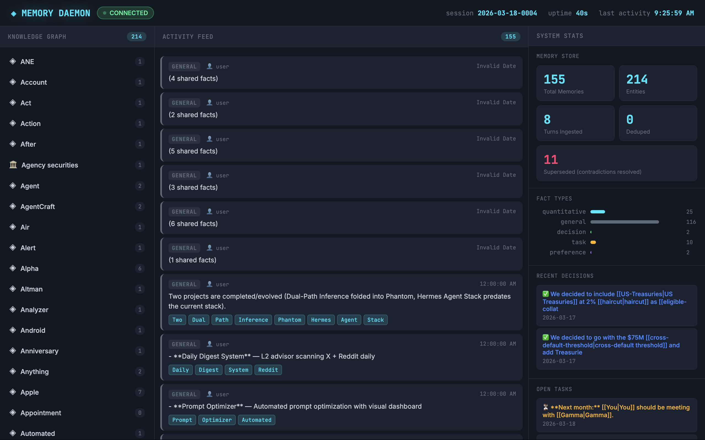

# Phantom Memory

Zero-cost persistent memory for local LLMs — extraction, embedding, and a continuous enrichment loop that organizes your knowledge while you sleep.

## The pitch

Every local LLM forgets. Phantom remembers — and it doesn't just store facts, it thinks about them. A continuous enrichment loop reclassifies, builds relationships, detects staleness, finds cross-entity patterns, and consolidates profiles. Your vault gets smarter while you sleep.

Three processors. Three loops. GPU throughput within noise of baseline when daemon is running.

```
┌─ GPU ────────────────────────────────────┐
│  Your LLM — conversation + reasoning     │
└──────────────────────────────────────────┘
┌─ CPU ────────────────────────────────────┐
│  Memory Daemon — extract, embed, store   │
│  1,721 emb/sec (all-MiniLM-L6-v2, 22M   │
│  params, 384-dim, batch=64, M5 Air CPU)  │
└──────────────────────────────────────────┘
┌─ ANE (optional) ────────────────────────┐
│  Enricher — classify, relate, analyze    │
│  Always-on, ~2W                          │
└──────────────────────────────────────────┘
```

## Dashboard



Real-time visualization of the knowledge graph, activity feed, memory stats, fact type distribution, and recent decisions. Dark cyberpunk UI at `http://localhost:8422`.

## Quick start

```python
from daemon import MemoryDaemon

# Basic — memory only
daemon = MemoryDaemon(vault_path="~/vault")
daemon.start()

# Full stack — memory + enricher (recommended)
daemon = MemoryDaemon(vault_path="~/vault", enable_enricher=True)
daemon.start()

# Custom enricher interval (default 300s)
daemon = MemoryDaemon(
    vault_path="~/vault",
    enable_enricher=True,
    enricher_interval=60,  # seconds
)
daemon.start()

# Ingest conversation turns
daemon.ingest("user", "We agreed to set the cross-default threshold at $75M for Counterparty Alpha")
daemon.ingest("assistant", "Noted. That's higher than the $50M standard for BBB+ entities.")

# Semantic recall
results = daemon.recall("cross-default thresholds")

# One-shot enrichment (run all sweeps once, then exit)
daemon.enrich_once()
```

## Continuous enrichment

Five sweeps run continuously in the background, analyzing and improving your vault:

| Sweep | What it does | Status |
|-------|-------------|--------|
| **RECLASSIFY** | Fixes facts filed as "general" that should be decision/task/preference/quantitative | Working |
| **RELATE** | Builds entity relationship graph + `graph.json` | Working — 40+ relationships found |
| **STALE** | Flags outdated time-sensitive facts (deadlines, "by Friday", temporal refs) | Working |
| **PATTERNS** | Cross-entity analysis — outliers, similar profiles, recurring provisions | Working — 35 insights generated |
| **CONSOLIDATE** | Auto-generates entity profile summaries pinned to top of entity pages | Working |

### What gets created in the vault

```
vault/memory/
├── relationships.md          # Entity graph with wikilinks
├── graph.json                # Machine-readable graph (for dashboard/agent consumption)
├── insights/
│   ├── patterns-2026-03-18.md  # Cross-entity analysis
│   └── stale-2026-03-18.md     # Staleness flags
├── entities/
│   ├── counterparty-alpha.md   # Auto-generated profile at top
│   ├── jpmorgan.md
│   └── ...
├── facts/
├── decisions/
├── preferences/
└── tasks/
```

### Sample insight note

What Phantom produces overnight while your LLM is idle:

```markdown
# ◈ Phantom Insights — 2026-03-18

## Threshold Inconsistencies
- Counterparty Alpha: $75M cross-default (BBB+)
- Counterparty Beta: $50M cross-default (BBB+)
- Same rating, 50% threshold difference. Intentional?

## Stale Items
- "Draft counter-proposal by Friday" (from March 14) — likely past

## Entity Summaries Updated
- Counterparty Alpha: 47 facts → 5-line profile (updated overnight)
```

### ANE-ready architecture

`Classifier` and `Embedder` are protocols — swap in a CoreML model with zero changes to sweep logic:

```python
class Classifier(Protocol):
    def classify(self, text: str) -> str: ...

class Embedder(Protocol):
    def embed(self, texts: list[str]) -> np.ndarray: ...
```

Currently runs on CPU with regex-based heuristics. On Apple Silicon with a CoreML model loaded, classification runs on the Neural Engine at ~2W.

## How memory works

### Extraction

Every conversation turn passes through `FactExtractor`:
- Regex-based entity detection (organizations, people, amounts, dates)
- Fact type classification (decision, task, preference, quantitative, general)
- Quantity parsing ($75M, 50 basis points, etc.)
- Deduplication against existing memories via cosine similarity

### Embedding and storage

- **sentence-transformers** (`all-MiniLM-L6-v2`, 22M params, 384 dimensions) on CPU
- 1,721 embeddings/sec measured on M5 Air CPU with batch size 64
- **ChromaDB** for persistent vector storage with cosine similarity search
- Semantic recall: query in natural language, get relevant facts ranked by relevance

### Vault writing

Extracted facts are written as structured markdown to an Obsidian-compatible vault:
- One file per entity, fact, decision, task
- Wikilinks between related entities
- Machine-readable frontmatter (type, date, entities, confidence)

## Benchmarks

### Three-tier eval suite (`eval_tiers.py`)

Custom validation suite — not a standardized benchmark, but a functional test that verifies each tier can perform its intended task:

```
CPU (extraction + recall) ....... 12/12 (100%)
ANE (1.7B analysis) ............  5/5  (100%)
GPU (9B reasoning) .............  5/5  (100%)
TOTAL .......................... 22/22 (100%)
Completed in 45.1s
```

**CPU tier (12 tests):** Fact extraction from ISDA paragraph (all 4 types), entity detection (10 entities including Counterparty Alpha), semantic recall accuracy, type filtering, noise rejection.

**ANE tier (5 tests):** Entity summarization (JPMorgan profile), relationship extraction (4 entities), risk identification (low cross-default threshold), quantity extraction (4 dollar amounts from CSA text). All under 2 seconds. Requires ANE server running (`ane_server.py`).

**GPU tier (5 tests):** Domain explanation (5/6 terms), risk comparison, JSON generation, tool call formatting. Requires MLX server on port 8899.

Run it yourself:
```bash
~/.mlx-env/bin/python3 eval_tiers.py
```

### Concurrent performance

GPU inference measured with and without the memory daemon processing embeddings. Single-run measurements, representative of typical usage:

| Scenario | GPU tok/s | Impact |
|----------|-----------|--------|
| GPU alone | 24.4-25.0 | baseline |
| GPU + daemon (20 embeddings) | 25.4 | within noise |
| GPU + daemon (100 embeddings) | 25.9 | within noise |

All concurrent measurements fall within the ±2-3 tok/s run-to-run variance of the baseline (~25 tok/s). The daemon runs on CPU efficiency cores while GPU handles inference. They share the memory bus but not compute resources. On a single-run basis, interference is indistinguishable from noise.

### Embedding throughput

| Model | Params | Dimensions | Batch size | Speed | Hardware |
|-------|--------|-----------|------------|-------|----------|
| all-MiniLM-L6-v2 | 22M | 384 | 64 | 1,721 emb/sec | M5 Air CPU |

## Agent self-knowledge (playbook)

When integrated with the Phantom agent framework, the agent maintains a self-assessment document (`playbook.md`) it reads at boot and updates after tasks:

- **What works / what doesn't** — learned from experience, not hardcoded
- **High-signal sources** — builds over time as the agent discovers useful feeds
- **Self-eval metrics** — tracks accuracy, tool chain success rates
- **Improvement queue** — next things to try
- **Lessons learned** — persistent behavioral memory

The playbook lives in the vault (visible in Obsidian) and survives restarts.

## API reference

### MemoryDaemon

```python
daemon = MemoryDaemon(
    vault_path: str,              # Path to Obsidian vault
    db_path: str = None,          # ChromaDB path (default: ./chromadb_live)
    enable_enricher: bool = False, # Start continuous enrichment loop
    enricher_interval: int = 300,  # Seconds between enrichment sweeps
)

daemon.start()                    # Boot daemon + enricher (if enabled)
daemon.stop()                     # Shutdown gracefully

daemon.ingest(role, text)         # Extract facts from text, embed, store, write to vault
daemon.recall(query, n=5, type_filter="")  # Semantic search over memories
daemon.stats()                    # {extracted, stored, deduped, superseded, total_memories}
daemon.enrich_once()              # Run all 5 enrichment sweeps once
```

### PhantomEnricher

```python
from enricher import PhantomEnricher

enricher = PhantomEnricher(
    store=memory_store,           # MemoryStore instance (ChromaDB)
    vault=vault_writer,           # VaultWriter instance
    interval=300,                 # Seconds between sweeps
)

enricher.start()                  # Background thread, runs forever
enricher.stop()
enricher.run_once()               # One-shot: all 5 sweeps, then return
```

### SweepEngine

```python
from enricher import SweepEngine

engine = SweepEngine(store=memory_store, vault=vault_writer)
engine.sweep_reclassify()         # Fix mistyped facts
engine.sweep_relate()             # Build relationship graph
engine.sweep_stale()              # Flag outdated facts
engine.sweep_patterns()           # Cross-entity anomaly detection
engine.sweep_consolidate()        # Generate entity profiles
```

## Hardware

- MacBook Air M5, 16GB unified memory, 10 GPU cores, 16 Neural Engine cores
- macOS 26.3 (Tahoe)
- MLX 0.31.1, Qwen3.5-9B-MLX-4bit (GPU), Qwen3-1.7B CoreML (ANE, optional)

## Requirements

- Python 3.11+
- macOS (tested on M5 Apple Silicon, works on Intel with CPU-only)
- ChromaDB, sentence-transformers, numpy

```bash
pip install chromadb sentence-transformers numpy
```

Optional for ANE tier:
- CoreML model converted via [ANEMLL](https://github.com/Anemll/Anemll)
- `ane_server.py` running with persistent CoreML model

## Related

- [orion-ane](https://github.com/MidasMulli/orion-ane) — Parent repo. ANE training + agent framework.
- [four-path-mlx](https://github.com/MidasMulli/four-path-mlx) — Speculative decoding server that uses this memory system
- [dual-path-inference](https://github.com/MidasMulli/dual-path-inference) — Initial GPU+ANE concurrency proof-of-concept (archived)
- [gdn-coreml](https://github.com/MidasMulli/gdn-coreml) — GatedDeltaNet SSM to CoreML converter

## License

MIT
